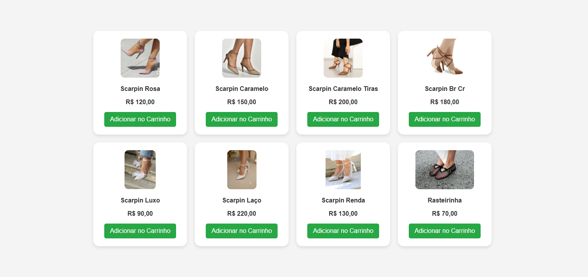

# 👟 Loja de Calçados - Vitrine Digital

Uma plataforma de e-commerce moderna desenvolvida para testar fluxos de automação de produtos e interfaces de usuário responsivas..

---

## 📸 Demonstração
 


---

## 🚀 Tecnologias e Ferramentas


* **HTML5/CSS3**: Estrutura e estilização moderna através dos arquivos `index.html` e `style.css`..
* **JavaScript**: Automação da vitrine e lógica de busca contida no `main.js`..
* **GitHub Pages**: Deploy contínuo e hospedagem para testes em tempo real..
## 🛠️ Configuração do Projeto (Build Setup)

Para rodar o projeto localmente ou em ambiente de desenvolvimento como o Codespaces:.

```bash
# Para visualizar o site localmente (usando Python como servidor)
python3 -m http.server 3004
